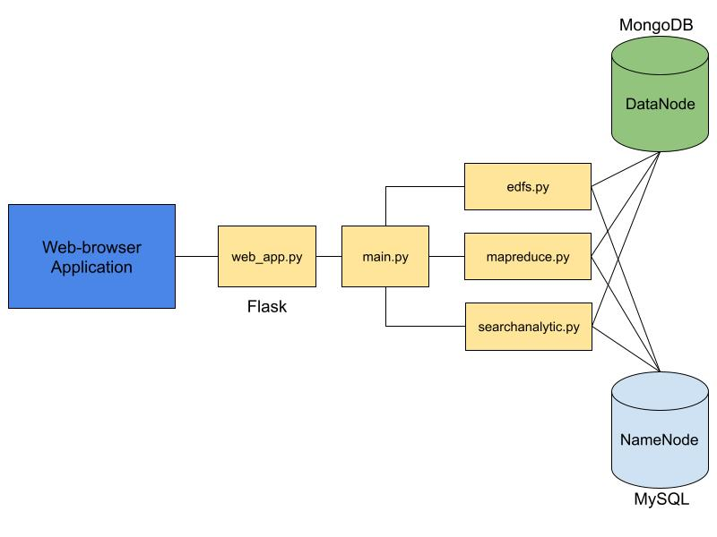
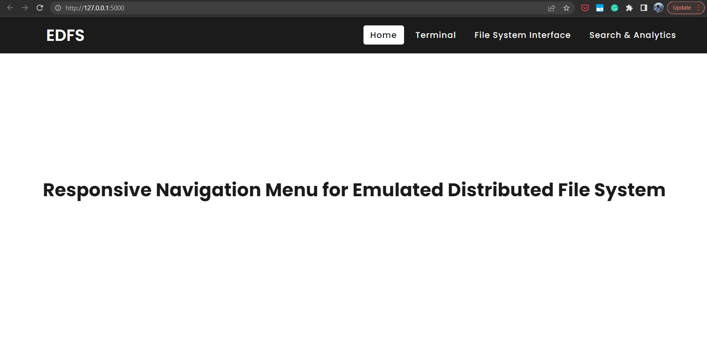
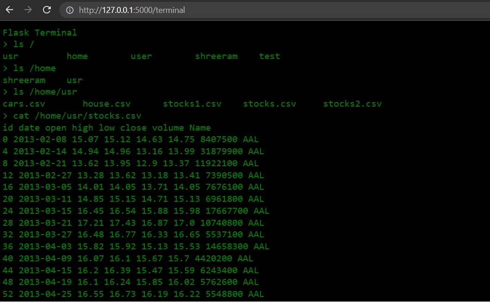
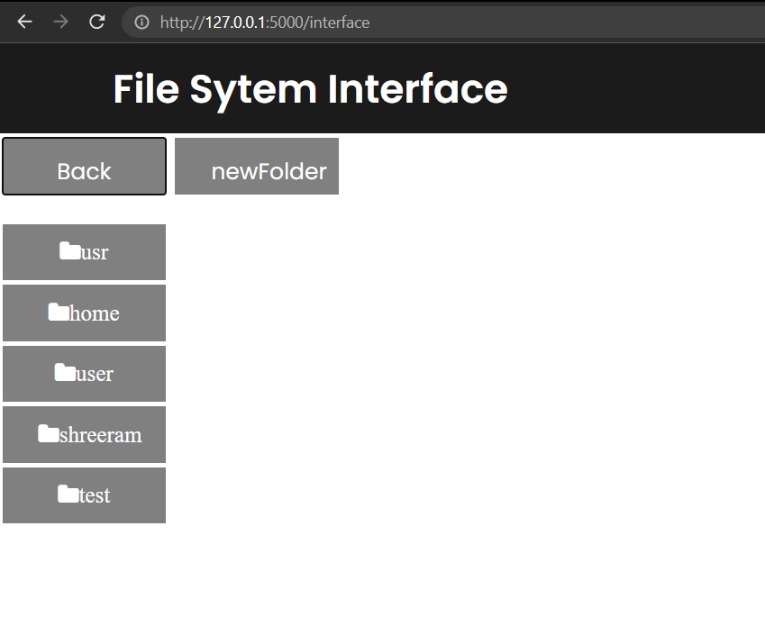

# Emulated Distributed File System

## Project Description

* This project involves building a distributed file system similar to Hadoop Distributed File System (HDFS) and implementing commands like `mkdir, ls, cat, rm, put, getPartitionLocations, readPartition`.
* Utilizing 2 Databases namely `MongoDB` and `MySQL` to store actual data of the file and the metadata of the file (considered as datanode and namenode) respectively.
* Implementing the partitioning-based `map` and `reduce` for the file stored in the DFS
*  Building a `web application` which takes the above commands as input from the user and displays the results on a web page. Also, the web application will have `search and analytics` components.

## Project Overview

 

 
 
Implementation Modules

 

## Implementation Details

* The project would involve python scripts each for the EDFS implementations, search and analytics functions and for the partition-based map reduce implementation.
* The EDFS commands to be implemented would be API calls which would be handled in the python script and when a data is inputted in the EDFS, the metadata (namenode) related to the file would be stored in a MySQL database and the actual data (datanode) would be stored in a MongoDB database.
* Once the partitioning of the data into data blocks is completed, the mapreduce python script will run a EDFS Map reduce on the partitioned data. The input to the map function would be a partition of the data followed by the reduce function which will combine/reduce them further.
* Finally, a web application is developed using Flask that will involve 2 components namely
    * Command Line Input Tab: It’ll consist of form fields where a user can enter the EDFS commands and the web app will return the results on the page.
    * Search and Analytics Tab: The user can carry out search and carry out some defined analytics for the given datasets. The web application will interact with both the Databases and run the search and analytics related functions to return the desired results.

## Application UI

 

 
 
Web Application Homepage

 

 

 
 
Web Application Terminal

 

 

 
 
Web Application Navigation Interface

 

## Project Timeline

|                                      Task                                     	            |     Target Date     	|    Status   	|
|:--------------------------------------------------------------------------------------     	|:-------------------:	|:-----------:	|
| MySQL and MongoDB based emulation of EDFS                                     	            |  15 Oct 2022 	        | Completed 	|
| Implement partition based map and reduce on the data stored in EDFS           	            |  30 Oct 2022 	        | Completed             	|
| Implement Search and Analytics functions on said datasets                     	            |  15 Nov 2022 	        | Completed             	|
| Develop a web application for searching and analyzing the data stored in EDFS 	            |  30 Nov 2022 	        | In Progress             	|

## Datasets Used

1. [S&P 500 Stock Dataset](https://www.kaggle.com/datasets/camnugent/sandp500) 
2. [Population Dataset](https://www.kaggle.com/datasets/tanuprabhu/population-by-country-2020) 
3. [Housing Price Dataset](https://datahub.io/core/house-prices-us#data)

## Current Progress

- [x] Create a Python script `load.py` that takes the CSV file cars.csv and loads it to Firebase real time database use Pandas. (Experimental)
- [x] Implement a Python script `search_price.py` that takes a range of price and outputs IDs of cars in the range using Firebase API. (Experimental)
- [x] Write a Python script `create_index.py` that creates a keyword index for keywords appearing in car name using REST API. (Experimental)
- [x] Implement a Python script `search_car.py` that finds IDs of cars using a list of keywords on car names using REST API. (Experimental)
- [x] Explore `Hadoop DFS` structure and commands using AWS EC2 Instance and store file structure in XML file. (Experimental)
- [x] Write template Map Reduce programs `mapper.py` and `reducer.py` for counting words in a document. (Experimental)
- [x] Write XML to TSV Python script for understanding `Hadoop File System image` stored in XML format and its traversal. (Experimental)
- [x] Write `MongoMetadata` class to interact with the Emulated Distributed File System stored as a JSON document.
- [x] Implement Flask web application in `web_app.py` and `index.html`, `landing_page.html` and `terminal.html` frontend pages.
- [x] Complete put function in `MongoMetadata` for uploading the csv file to the Azure MySQL database.

